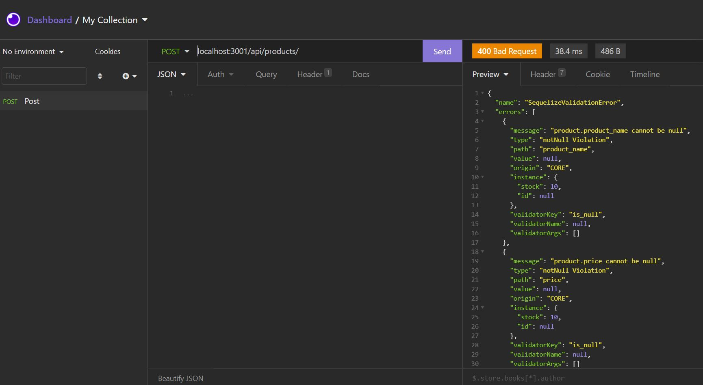

# ecommerce-backend-HW13

## Description

My task is to build the back end for an e-commerce site by modifying starter code. I’ll configure a working Express.js API to use Sequelize to interact with a MySQL database.

## How to use:
If you would like to use this application clone this repo and down below are the steps to follow after you clone it 

* Run `npm init -y` to set up package.json, 

* Install dependencies: sql2, express, sequalize and dotenv

* Connect to mysql database (db folder)

* Run `node seeds/index.js` to seed the data properly, then `node server.js` to create connection.

# Links 
 Repo Link:
 Demo Video Link: 

# Screenshots
 
 

  

   

 